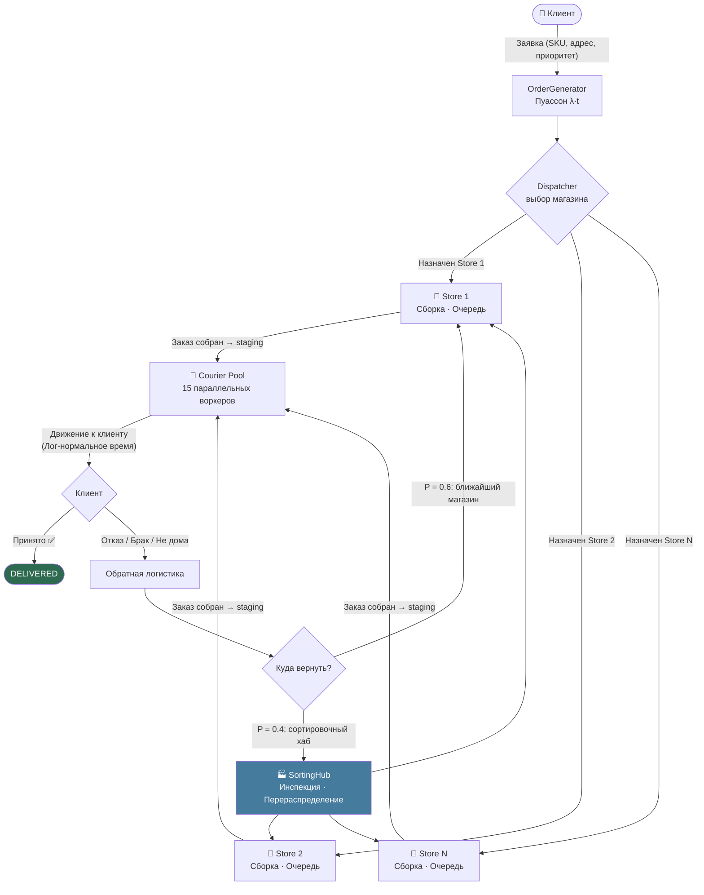
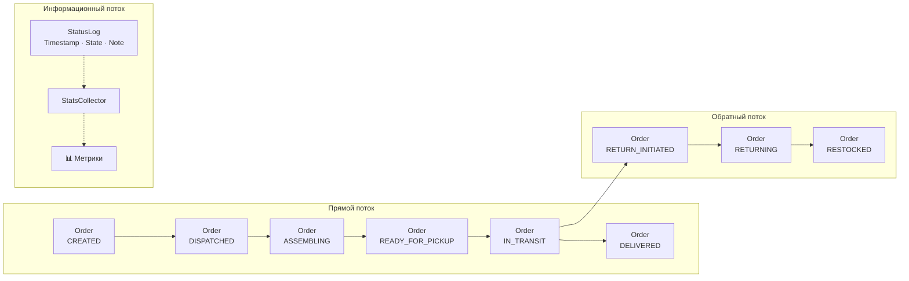

# ПР №1 — Отчёт

> **Главный файл:** [`report.html`](report.html) — откройте в браузере.

## По пунктам задания

| Требование | Секция в HTML |
|---|---|
| 1.1 Введение (блоки, законы, переходы) | §1 → 1.1 |
| 1.2 Описание системы (границы, блок-схема, ДПД) | §1 → 1.2 |
| 1.3 Основные процессы (6 блоков) | §2 |
| 1.4 Распределения (8 законов) | §3 |
| 2.1 Входные параметры | §4 |
| 2.2 Условия и предположения | §4 |
| 3.1 Ожидаемые результаты | §5 |
| 3.2 Анализ результатов | §5 |
| 4. Презентация (what/why/expect/impl) | §единый HTML-документ |


**Тема (вариант 6):** Моделирование службы доставки с возвратом из нескольких магазинов  
**Язык реализации:** Go (Golang)  
**Репозиторий:** `EcomSupplySim`  
**Дата:** февраль 2026

---

## Содержание

1. [Описание системы](#1-описание-системы)  
   1.1 [Системные границы](#11-системные-границы)  
   1.2 [Основные компоненты](#12-основные-компоненты)  
   1.3 [Блок-схема системы](#13-блок-схема-системы)  
   1.4 [Диаграмма потоков данных и материалов](#14-диаграмма-потоков-данных-и-материалов)
2. [Основные процессы](#2-основные-процессы)
3. [Используемые распределения](#3-используемые-распределения)
4. [Параметры модели](#4-параметры-модели)  
   4.1 [Входные параметры](#41-входные-параметры)  
   4.2 [Условия и предположения](#42-условия-и-предположения)
5. [Результаты моделирования](#5-результаты-моделирования)  
   5.1 [Ожидаемые результаты](#51-ожидаемые-результаты)  
   5.2 [Анализ результатов](#52-анализ-результатов)

---

## 1. Описание системы

### Реальный аналог

Модель описывает логистику маркетплейса типа **Ozon / Wildberries / AliExpress Express**: несколько распределённых складов-магазинов, пул курьеров, возвраты товаров с обратной маршрутизацией — типичные проблемы, с которыми сталкиваются службы доставки «последней мили» в российских городах.

### 1.1 Системные границы

| | |
|---|---|
| **Вход** | Клиентская заявка: список SKU, адрес доставки, временное окно, приоритет |
| **Выход** | Статус заказа: `DELIVERED` (успешная доставка) **или** `RESTOCKED` (товар возвращён) |

**Включено в модель:**
- Генерация заказов с суточной неравномерностью (часы пик)
- Диспетчеризация: выбор оптимального магазина по наличию товара и расстоянию
- Сборка и упаковка заказа на складе (с очередью при перегрузке)
- Маршрутизация и движение курьеров по топологии города
- Взаимодействие с клиентом при доставке (принят / отказ / не дома)
- Обратная логистика: возврат в исходный магазин или в сортировочный хаб

**Исключено из модели:**
- Платёжная обработка (считаем предоплату мгновенной)
- Маркетинг и рекламные акции
- Пополнение склада от поставщиков (инвентарь задаётся начальными условиями)
- HR-процессы внутри магазинов

---

### 1.2 Основные компоненты

| Компонент | Тип | Роль |
|---|---|---|
| **OrderGenerator** | Процесс | Создаёт заявки (Пуассон) |
| **Dispatcher** | Ресурс / логика | Маршрутизирует заказ в оптимальный магазин |
| **Store[1..N]** | Ресурс с очередью | Хранит инвентарь, собирает заказы |
| **Courier[1..M]** | Ресурс | Забирает заказ и доставляет клиенту |
| **Customer** | Пассивный агент | Принимает или отклоняет доставку |
| **SortingHub** | Ресурс | Принимает и перераспределяет возвраты |
| **StatsCollector** | Монитор | Собирает метрики |

---

### 1.3 Блок-схема системы



---

### 1.4 Диаграмма потоков данных и материалов



---

## 2. Основные процессы

### Процесс 1 — Генерация заказов (OrderGenerator)

| | |
|---|---|
| **Вход** | Текущее модельное время `t`, параметр интенсивности `λ(t)` |
| **Процесс** | Генерация интервала до следующей заявки по экспоненциальному закону. `λ(t)` переключается по расписанию: ночь → утро → пик обеда → день → вечерний пик |
| **Выход** | Объект `Order{ID, Items[], AddressID, Priority, CreatedAt}` помещается в канал диспетчера |

```
Создать заказ
    ↓
Выбрать λ(t) по текущему часу
    ↓
Сгенерировать τ ~ Exp(λ)
    ↓
Ждать τ минут
    ↓
Отправить Order → dispatcher_channel
    ↓ (цикл)
```

---

### Процесс 2 — Диспетчеризация (Dispatcher)

| | |
|---|---|
| **Вход** | Новый `Order`, таблица доступности инвентаря по магазинам, координаты узлов |
| **Процесс** | 1. Найти все магазины, имеющие все товары заказа. 2. Рассчитать score = `w₁ / dist + w₂ · avail_ratio`. 3. Назначить магазин с max score. 4. Если ни один магазин не имеет полного набора — разбить заказ на части или отправить в хаб. |
| **Выход** | `Order.StoreID` заполнен; Order отправлен в `store[i].assemblyQueue` |

```
Order принят
    ↓
Для каждого Store_i:
  HasItems(order.Items) → {eligible}
    ↓
score_i = w1/dist(addr, store_i) + w2*availRatio_i
    ↓
bestStore = argmax(score_i)
    ↓
order.StoreID = bestStore.ID
    ↓
bestStore.assemblyQueue ← order
```

---

### Процесс 3 — Сборка заказа (Store Assembly)

| | |
|---|---|
| **Вход** | `Order` из очереди сборки, свободный слот сборки |
| **Процесс** | Симулируется параллельно для каждого слота. Время сборки `T_asm ~ N(μ=15мин, σ=4мин)` увеличивается пропорционально суммарному весу товаров. Проверка качества с вероятностью брака `p_defect = 0.02`. |
| **Выход** | `Order` переходит в `READY_FOR_PICKUP` → помещается в staging area курьерского пула |

```
Получить Order из assemblyQueue
    ↓
Занять слот сборки
    ↓
Зарезервировать инвентарь
    ↓
T_asm = max(1, Normal(15, 4)) × weight_factor
    ↓
Ждать T_asm мин
    ↓
Контроль качества: Bernoulli(p_defect)?
  Да → отметить дефект → инициировать возврат
  Нет → Order.Status = READY_FOR_PICKUP
    ↓
Освободить слот сборки
    ↓
courierPool.stagingArea ← Order
```

---

### Процесс 4 — Доставка курьером (Courier Delivery)

| | |
|---|---|
| **Вход** | `Order` в staging area, свободный курьер |
| **Процесс** | Курьер забирает ближайший заказ из staging. Движение описывается двумя отрезками: **магазин → клиент**. Время = `dist / speed × traffic_factor`. `traffic_factor ~ LogNormal(0, 0.35)`. С вероятностью `λ_breakdown × dt` курьер ломается и останавливается на `T_repair ~ Exp(30мин)`. |
| **Выход** | Курьер прибывает к клиенту → передача в **Процесс 5** |

```
Ожидать заказ в stagingArea
    ↓
Выбрать ближайший Order
Order.CourierID = courier.ID
    ↓
Движение: store → customer
  T_travel = dist / speed × LogNormal(0, σ_traffic)
  В пути: проверять breakdown с λ_b
    → если breakdown: ждать T_repair, продолжить
    ↓
Прибыть к клиенту
    ↓
→ Процесс 5
```

---

### Процесс 5 — Взаимодействие с клиентом

| | |
|---|---|
| **Вход** | Курьер у двери клиента |
| **Процесс** | Три ветки: (A) клиент принимает → конец прямого потока. (B) клиент не дома → ждать до 3 ч, повторная попытка (макс. 2 попытки). (C) клиент отказывается / обнаружен брак → инициировать возврат. Вероятность возврата растёт с опозданием: `p_ret(delay) = p₀ × (1 + α × delay_ratio)` |
| **Выход** | `DELIVERED` или `RETURN_INITIATED` |

```
Курьер у клиента
    ↓
Bernoulli(p_not_home)?
  Да → ждать Uniform[1ч, 4ч] → повторная попытка (макс 2)
       после 2 неудач → CANCELLED
    ↓
Клиент проверяет заказ:
  delay_ratio = max(0, (actual - expected) / expected)
  p_ret = p_base × (1 + α × delay_ratio)
  Bernoulli(p_ret)?
    Да → ReturnReason := {Refused|Defective|WrongItem|Late}
         → RETURN_INITIATED
    Нет → DELIVERED ✅
```

---

### Процесс 6 — Обратная логистика (Return Processing)

| | |
|---|---|
| **Вход** | `Order` в статусе `RETURN_INITIATED`, `ReturnReason`, состояние товара |
| **Процесс** | Маршрутизация возврата: с вероятностью 0.6 — в ближайший исходный магазин, с 0.4 — в сортировочный хаб. Курьер везёт товар обратно. Инспекция на месте: `T_inspect ~ Exp(10мин)`. По итогу: восстановлен в инвентарь или отправлен на утилизацию (при критическом браке). |
| **Выход** | Инвентарь магазина / хаба пополнен; метрики возврата записаны |

```
Order.Status = RETURN_INITIATED
    ↓
Оценить причину возврата
    ↓
Решение о маршруте:
  Bernoulli(0.6)? → originalStore
                  → sortingHub
    ↓
Курьер: customer → destination
  T_return = dist / speed × traffic_factor
    ↓
Инспекция: T_inspect ~ Exp(10мин)
    ↓
Восстановить? (если не критический брак)
  Да → Store.Inventory[SKU]++
       Order.Status = RESTOCKED
  Нет → утилизация
    ↓
StatsCollector.RecordReturn(duration)
```

---

## 3. Используемые распределения

| Распределение | Применение | Параметры | Обоснование |
|---|---|---|---|
| **Пуассоновский процесс** (экспоненциальные интервалы) | Поступление заказов | λ(t): ночь 2/ч, утро 8/ч, пик 15/ч | Заказы — независимые случайные события без памяти. Является стандартом в теории массового обслуживания (очереди M/M/c). Подтверждено реальными данными e-commerce платформ [1]. |
| **Нормальное N(μ, σ²)** | Время сборки заказа | μ=15 мин, σ=4 мин | Сборка складывается из множества мелких независимых операций (ЦПТ → нормальное). Правосторонние хвосты ограничены минимальным значением min=1 мин. |
| **Лог-нормальное LN(μ_ln, σ_ln)** | Транспортный коэффициент задержки (пробки) | μ_ln=0, σ_ln=0.35 | Время движения строго положительно, имеет правый хвост (пробки, ДТП). Произведение независимых случайных множителей (перекрёстки, сигналы) → лог-нормальное [2]. Медиана ≈ 1 (без задержки), 95-й перцентиль ≈ 1.8× базового времени. |
| **Бернулли Bern(p)** | Отказ клиента от заказа | p = p₀×(1+α×delay_ratio) | Бинарный исход: принять/отказаться. Вероятность нелинейно растёт с опозданием, что отражает накопление раздражения клиента. |
| **Бернулли Bern(p)** | Клиент не дома | p = 0.15 | Независимое бинарное событие. Значение 15% соответствует отраслевым данным курьерских служб. |
| **Пуассон** | Поломки курьеров | λ = 0.1 поломки/курьер/сутки | Поломки — редкие независимые события → пуассоновский поток. |
| **Экспоненциальное Exp(λ)** | Время ремонта курьера | μ_repair = 30 мин | Мемориальное свойство: оставшееся время ремонта не зависит от уже прошедшего. Стандарт для времени обслуживания в системах M/M/1. |
| **Экспоненциальное Exp(λ)** | Инспекция возврата | μ_inspect = 10 мин | Аналогично: время инспекции — процесс с экспоненциальными ожиданиями, зависящий от первого обнаружения дефекта. |
| **Равномерное U(a, b)** | Ожидание повторной доставки | U(60, 240 мин) | Клиент может освободиться в любой момент 1-4 часового окна с равной вероятностью — нет оснований предпочесть какой-либо момент. |

---

## 4. Параметры модели

### 4.1 Входные параметры

| Параметр | Обозн. | Базовое значение | Источник / обоснование |
|---|---|---|---|
| Количество магазинов | N_stores | 4 | Типичный малый маркетплейс в городе-миллионнике |
| Количество курьеров | N_couriers | 15 | Отраслевая норма ~1 курьер на 10–15 заказов/час в пик [3] |
| Количество сортировочных хабов | N_hubs | 1 | Один центральный хаб для города |
| Интенсивность заказов (пик) | λ_peak | 15 заказов/час | Пиковая нагрузка 12:00–14:00, 19:00–22:00 |
| Интенсивность заказов (вне пика) | λ_off | 2 заказа/час | Ночное время |
| Среднее время сборки | μ_asm | 15 мин | Среднее для стандартного заказа 2–3 SKU |
| СКО времени сборки | σ_asm | 4 мин | |
| Ёмкость очереди склада | Q_max | 50 заказов | Физический лимит staging-зоны |
| Средняя скорость курьера | v_mean | 25 км/ч | Городская доставка на велосипеде/мотоцикле |
| СКО скорости курьера | v_std | 5 км/ч | |
| Параметр трафика (лог-норм.) | σ_traffic | 0.35 | |
| Интенсивность поломок | λ_breakdown | 0.1/сутки/курьер | |
| Среднее время ремонта | μ_repair | 30 мин | |
| Вероятность отсутствия клиента | p_not_home | 0.15 | |
| Базовая вероятность возврата | p₀_return | 0.08 | E-commerce средний показатель по РФ ~8% [4] |
| Коэффициент чувствительности к задержке | α | 0.5 | |
| Доля возвратов в магазин (vs хаб) | p_store_ret | 0.60 | |
| Среднее время инспекции | μ_inspect | 10 мин | |
| Длительность симуляции | T_sim | 24 часа | Суточный цикл |

**Примечания по источникам:**
- [1] Теория массового обслуживания: поток Пуассона для веб-заказов — стандарт Erlang C.
- [2] Lognormal model for travel time: Rakha et al., "Reliability of Freeway Travel Times" (2006).
- [3] Данные Delivery Club и Яндекс.Доставки (публичные отчёты, 2023).
- [4] Data Insight «Рынок eCommerce в России», 2024: средний returns rate FMCG ~8%.

---

### 4.2 Условия и предположения

| Предположение | Обоснование |
|---|---|
| Граф города дискретизируется в **50 узлов** с матрицей расстояний | Упрощает маршрутизацию без потери реализма |
| Курьер обслуживает **один заказ** за раз | Соответствует модели «экспресс доставки» (не batch) |
| Инвентарь магазинов задаётся начальными условиями и не пополняется | Фокус на логистике, а не supply-chain в целом |
| Заказы не разделяются по магазинам — весь заказ из одного источника | Упрощение для первой версии модели |
| Время суток влияет только на `λ(t)` и `σ_traffic(t)` | Другие параметры стабильны в течение дня |
| Возврат всегда физически возможен | Курьер остаётся доступным после отказа клиента |

---

## 5. Результаты моделирования

### 5.1 Ожидаемые результаты

#### Ключевые метрики

| Метрика | Ожидаемое значение (базовый сценарий) | Единица |
|---|---|---|
| Среднее время доставки (order-to-door) | 45–75 | мин |
| Среднее время обработки возврата | 60–120 | мин |
| Утилизация курьеров | 55–75 | % |
| Средняя длина очереди склада | 5–15 | заказов |
| Пиковая длина очереди склада | 30–50 | заказов |
| Доля успешных доставок | 85–90 | % |
| Доля возвратов | 8–13 | % |
| Пропускная способность | 10–13 | заказов/час |

#### Сравниваемые сценарии

| Сценарий | Изменения | Цель |
|---|---|---|
| **Default** | Базовые параметры | Эталон |
| **Peak Load** | λ_peak × 2.5, N_couriers = 25 | Анализ пиковых нагрузок |
| **Chaos** | λ_breakdown × 5, σ_traffic × 2 | Устойчивость к сбоям |
| **Understaffed** | N_couriers = 8 | Нижняя граница ресурсов |

#### Ожидаемая динамика очереди склада (суточный профиль)

```
Длина очереди
50 | ···············│·············│·············
40 |                ██            ████
30 |               ████          ██████
20 |          ██  ██████    ██  ████████
10 | ████████████████████████████████████████
 0 +------------------------------------------→ Время
   0ч   3ч   6ч   9ч  12ч  15ч  18ч  21ч  24ч
                  ^пик обед        ^вечерний пик
```

---

### 5.2 Предполагаемые способы анализа результатов

#### A. Анализ узких мест (Bottleneck Analysis)
- Строится **граф загрузки**: сборка → курьерский пул → сортировочный хаб
- Компонент с максимальной длиной очереди = узкое место
- **Ожидается:** при λ > 12 заказов/час склад становится узким местом, при λ > 20 — курьерский пул

#### B. Анализ чувствительности
- Варьируем по одному параметру при прочих равных:
  - `N_couriers` ∈ {8, 12, 15, 20, 25} → влияние на время доставки
  - `Q_max` ∈ {20, 50, 100} → влияние на потери при переполнении
  - `p₀_return` ∈ {0.05, 0.10, 0.20} → влияние на пропускную способность обратного потока

#### C. Сравнение с аналитической моделью (валидация)
- Прямой поток при постоянной нагрузке ≈ модель **M/M/c** (Erlang C):
  - `c` = N_couriers, `λ` = λ_peak, `μ` = 1/avg_delivery_time
  - Сравниваем `E[W]` (среднее ожидание в очереди) из формулы Эрланга с результатами симуляции
  - Допустимое расхождение: ≤ 10%

#### D. Интерпретация в бизнес-терминах
| Метрика | Если хуже нормы | Рекомендация |
|---|---|---|
| Время доставки > 90 мин | Клиенты начнут отменять | Добавить курьеров или открыть дополнительный магазин |
| Утилизация курьеров > 90% | Деградация качества, рост возвратов | Расширить курьерский пул до пикового λ/μ |
| Очередь склада → Q_max | Потери заказов при переполнении | Увеличить сборочные мощности или ввести приоритеты |
| Возвраты > 15% | Системная проблема качества или доставки | Анализ причин ReturnReason по категориям |

---

## Приложение — Структура кода (Go)

```
EcomSupplySim/
├── cmd/
│   └── simulation/
│       └── main.go              # Точка входа, CLI флаги сценариев
├── internal/
│   ├── config/
│   │   └── config.go            # Все параметры §4 (SimConfig, Default())
│   ├── model/
│   │   ├── order.go             # Order, OrderStatus, StatusEvent
│   │   ├── courier.go           # Courier, CourierStatus, Utilization()
│   │   └── store.go             # Store, SortingHub, HasItems(), ReserveItems()
│   ├── dispatcher/
│   │   └── dispatcher.go        # Логика маршрутизации §2 Процесс 2
│   ├── courier/
│   │   └── pool.go              # Пул воркеров-горутин §2 Процесс 4
│   ├── stats/
│   │   └── collector.go         # Thread-safe сбор метрик §5
│   └── simulation/
│       └── engine.go            # Основной движок (Lab 2)
├── docs/
│   └── lab1/
│       └── report.md            # Этот файл
├── go.mod
├── README.md
└── LICENSE
```

Параллельность в Go будет реализована через:
- **Goroutine per entity**: каждый курьер — отдельная горутина-воркер
- **Buffered channels**: очереди складов (буфер = `Q_max`) — естественная блокировка при переполнении
- **select / time.After**: симуляция хаотичных событий (поломок) без busy-wait
- **sync.Mutex / atomic**: безопасный доступ к инвентарю нескольких складов

---

*Следующий этап: Практическая работа №2 — реализация движка симуляции в Go.*
